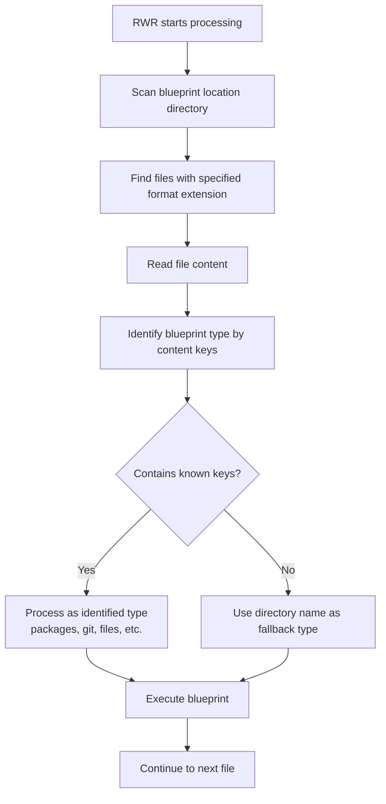

# RWR Examples

This directory contains example configurations for Rinse, Wash, Repeat (RWR) demonstrating various ways to organize and structure your blueprints.

## Important: Directory Structure is Optional

**The nested directory structure you see in this examples folder is purely for organizational convenience and is NOT required by RWR.**

RWR identifies blueprint types by their **content** (the keys like `packages:`, `git:`, `files:`, etc.), not by their file names or directory structure. This means you have complete flexibility in how you organize your blueprint files.

## Current Examples Structure

The current examples are organized by:

- Operating System (`linux/`, `macos/`, `windows/`)
- Distribution/Variant (`Arch/`, `Fedora/`, `Ubuntu/`)
- Format (`json/`, `yaml/`, `toml/`)
- Blueprint Type (`packages/`, `git/`, `files/`, etc.)

This structure helps with:

- ✅ **Human organization** - easier to find examples
- ✅ **Learning** - see how different OS/distros handle the same tasks
- ✅ **Reference** - compare implementations across formats

But it's **not technically required** for RWR to function.

## Alternative Approaches

See [`alternative_layouts/`](./alternative_layouts/) for simpler approaches that demonstrate:

- **Minimal Files**: Everything in just 2 files (`init.yaml` + `all_in_one.yaml`)
- **Flattened Structure**: Individual blueprint files at root level (no subdirectories)
- **Multiple Formats**: Same content shown in YAML, JSON, and TOML

## How RWR Discovers Blueprints

## Key Takeaways

1. **Blueprint identification is content-based**, not location-based
2. **Directory structure is for human convenience only**
3. **You can organize files however makes sense for your project**
4. **Multiple blueprint sections can coexist in single files**
5. **RWR processes all valid blueprint files in the specified location**

## Getting Started

For simpler setups, check out the [`alternative_layouts/`](./alternative_layouts/) directory. For comprehensive examples showing different OS configurations, explore the nested directories here.
