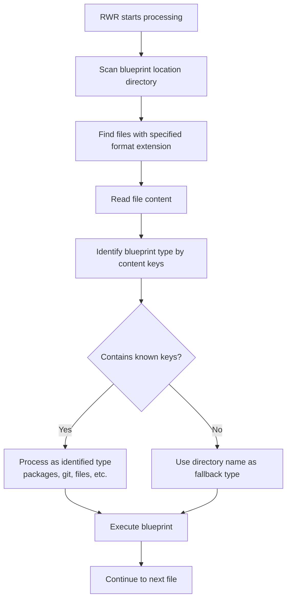

# RWR Examples

This directory contains example configurations for Rinse, Wash, Repeat (RWR). The examples show different ways to organize your blueprints.

## Important: Directory Structure is Optional

**RWR does not require the nested directory structure of this examples folder. The structure is only for organization.**

RWR identifies blueprint types by their **content** (for example the keys `packages:`, `git:`, and `files:`), not by their file names or directory structure. You can organize your blueprint files in any structure.

## Current Examples Structure

The current examples are organized by:

- Operating System (`linux/`, `macos/`, `windows/`)
- Distribution/Variant (`Arch/`, `Fedora/`, `Ubuntu/`)
- Format (`json/`, `yaml/`, `toml/`)
- Blueprint Type (`packages/`, `git/`, `files/`, and more)

This structure helps with:

- ✅ **Human organization** - you can find examples easily
- ✅ **Learning** - you can see how different operating systems and distributions handle the same tasks
- ✅ **Reference** - you can compare implementations across formats

But it is **not required** for RWR to function.

## Alternative Approaches

See [`alternative_layouts/`](./alternative_layouts/) for simpler approaches that demonstrate:

- **Minimal Files**: Everything in 2 files (`init.yaml` + `all_in_one.yaml`)
- **Flattened Structure**: Individual blueprint files at root level (no subdirectories)
- **Multiple Formats**: Same content shown in YAML, JSON, and TOML

## How RWR Discovers Blueprints

```mermaid
flowchart TD
    A[RWR starts processing] --> B[Scan blueprint location directory]
    B --> C[Find files with specified format extension]
    C --> D[Read file content]
    D --> E[Identify blueprint type by content keys]
    E --> F{Contains known keys?}
    F -->|Yes| G[Process as identified type<br/>packages, git, files, etc.]
    F -->|No| H[Use directory name as fallback type]
    G --> I[Execute blueprint]
    H --> I
    I --> J[Continue to next file]
```

## Key Takeaways

1. **Blueprint identification is content-based**, not location-based
2. **Directory structure is for human convenience only**
3. **You can organize files in the way that is best for your project**
4. **Multiple blueprint sections can coexist in single files**
5. **RWR processes all valid blueprint files in the specified location**

## Getting Started

For simpler setups, see the [`alternative_layouts/`](./alternative_layouts/) directory. For examples that show different OS configurations, see the nested directories here.
